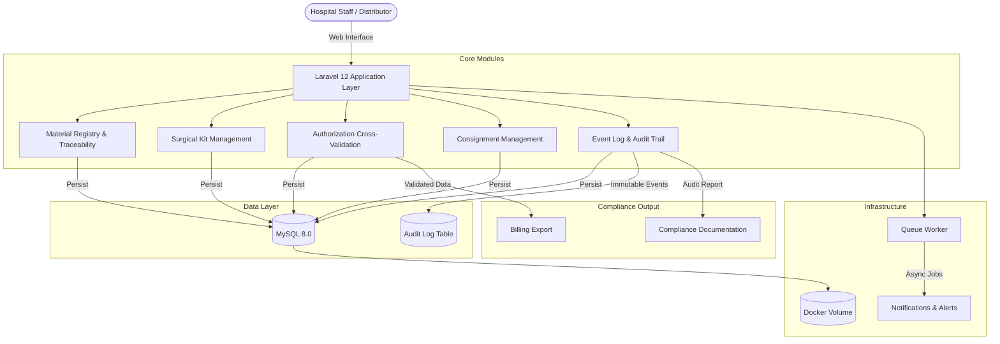

# OrtoTraceability

[](https://laravel.com)
[](https://php.net)
[](https://www.mysql.com)
[](https://www.docker.com)
[](https://opensource.org/licenses/MIT)
[]()

**OrtoTraceability** is an open-source, backend-first traceability and operational control system for implantable medical devices (OPME — Orthotics, Prosthetics, and Special Materials) within surgical supply chain environments. Built on Laravel 12 with an event-driven audit architecture, it provides end-to-end visibility into the lifecycle of surgical implants — from distributor receipt through intraoperative use, post-procedural reconciliation, and insurance claim validation.

This project is a functional MVP designed to demonstrate architectural principles for healthcare operational systems operating in high-reliability, compliance-driven environments. It reflects the author's deep professional experience in the design and implementation of proprietary healthcare ERP systems for real surgical environments.

> [!IMPORTANT]
> **Professional Disclaimer:** This is an original, independent technical work and does **not** replicate, expose, or reproduce any proprietary code, intellectual property, trade secrets, confidential data, or business information from any current or former employer. The system is built from scratch as a public demonstration of architectural methodology and technical expertise in healthcare systems engineering. All data used in seeds and examples is synthetic.

---

## The Problem This System Addresses

The management of implantable medical devices within hospital surgical environments is one of the most operationally complex and compliance-sensitive challenges in healthcare logistics. In both the Brazilian (ANVISA) and U.S. (FDA UDI) regulatory frameworks, implantable devices must be traceable from manufacturer to patient — yet the operational gap between regulatory mandate and actual hospital-level implementation remains significant across most healthcare institutions.

The consequences of inadequate traceability are concrete and costly:

- **Patient Safety Incidents** — missing or contaminated implants discovered intraoperatively cause surgical delays, kit reopening, extended anesthesia time, and in severe cases, procedure cancellation
- **Insurance Claim Denials** — materials used that were not pre-authorized, quantities exceeding approved levels, or substitutions lacking documentation result in rejected claims and direct financial loss
- **Compliance Exposure** — inability to demonstrate the chain of custody for an implanted device creates regulatory and legal liability
- **Inventory Inefficiency** — without real-time visibility into consignment stock at hospital institutions, replenishment is reactive, stockouts are common, and expired materials consume capital unnecessarily
- **Audit Failure** — manual and fragmented processes make forensic reconstruction of surgical material usage extremely difficult

OrtoTraceability is designed to close these gaps through a structured, auditable, event-driven operational platform.

---

## Core Architecture

The system is architected around four foundational design principles derived from the operational realities of high-volume surgical environments:

### 1. Unit-Level Traceability
Every material record is tracked at the individual unit level — not just by product category or lot, but by individual serial number and batch. This granularity is the minimum required for meaningful implant traceability under FDA UDI and equivalent frameworks.

### 2. Event-Driven State Management
Material state transitions (received → consigned → reserved → used/discarded → billed) are modeled as domain events, each producing an immutable audit record. This design prevents silent state corruption and provides a forensically reliable history of every material's lifecycle.

### 3. Authorization-Centric Workflow
The system treats the medical authorization (issued by the insurer for each procedure) as the central control document. Materials are validated against the authorization at reservation and post-procedural reconciliation stages, flagging discrepancies before they reach the billing submission pipeline.

### 4. Operational Separation of Critical and Reserve Materials
Surgical kit composition distinguishes between primary critical implants (required for the procedure), backup redundancy materials (covering contamination or sizing contingencies), and supplementary materials (procedure-dependent). This separation — enforced at the kit management layer — operationalizes the preventive model for surgical material management.

---

## System Architecture Diagram



---

## Feature Modules

### Material Registry & Traceability
- Registration of implantable devices by product type, manufacturer, lot number, serial number, and expiration date
- Consignment tracking: which materials are on consignment at which hospital institution, and since when
- Real-time status visibility: received, consigned, reserved for procedure, used, discarded, returned, billed
- Automated blocking of expired materials from reservation workflows
- Expiration alerting with configurable advance-warning windows

### Surgical Kit Management
- Procedure-specific kit templates defining required primary, backup, and supplementary materials
- Pre-procedural verification checklist generation — documented confirmation before kit dispatch
- Material categorization by criticality within each kit type
- Kit dispatch logging with timestamp and responsible staff identification
- Post-procedural material reconciliation: used vs. opened vs. returned

### Authorization Cross-Validation Engine
- Capture of insurance pre-authorization data: authorized materials, approved quantities, procedure codes
- Automated cross-reference of post-procedural usage records against authorization
- Discrepancy flagging before billing submission: unauthorized materials, quantity overages, undocumented substitutions
- Resolution workflow: supplementary authorization, clinical justification documentation, or billing adjustment
- Audit trail of all discrepancy resolution actions

### Consignment Management
- Full lifecycle management of consignment relationships between distributor and hospital institutions
- Replenishment threshold alerts by procedure type and institution
- Consignment reconciliation reporting by billing cycle
- Multi-institution support: manage parallel consignment relationships across hospital clients

### Event Log & Immutable Audit Trail
- All CRUD and state-transition operations automatically logged via custom audit trait
- Logs capture: actor (user ID and role), action type, entity affected, previous state, new state, timestamp, IP address
- Audit records are append-only — no update or delete operations permitted
- Exportable audit reports for regulatory compliance and forensic investigation

### Access Control & Information Security
- Role-based access control: administrator, distributor staff, hospital staff, read-only auditor
- All sensitive data access gated by role permissions
- Session management with configurable timeout policies
- Full compliance with LGPD (Brazilian data protection law) principles — adaptable to HIPAA considerations

---

## Tech Stack

| Layer | Technology |
|---|---|
| Backend Framework | Laravel 12 (PHP 8.2+) |
| Database | MySQL 8.0 |
| Frontend | Blade Templates, Tailwind CSS, Alpine.js |
| Infrastructure | Docker & Docker Compose |
| Queue Processing | Laravel Queues (database driver, Redis-ready) |
| Audit Architecture | Custom Eloquent audit trait with event observers |
| API Layer | RESTful API endpoints (JSON, for future mobile/ERP integration) |
| Authentication | Laravel Sanctum |
| Documentation | OpenAPI / Swagger (planned) |

---

## Installation and Setup

### Prerequisites
- [Docker](https://www.docker.com/) & Docker Compose
- [Composer](https://getcomposer.org/)
- [Node.js](https://nodejs.org/) (for frontend asset compilation)

### Setup Steps

```bash
# 1. Clone the repository
git clone https://github.com/Gabrielz11/OrtoTraceability.git
cd OrtoTraceability

# 2. Install PHP dependencies
composer install

# 3. Install frontend dependencies
npm install && npm run build

# 4. Configure environment
cp .env.example .env
php artisan key:generate

# 5. Start containerized services (MySQL + app)
docker-compose up -d

# 6. Run migrations and seed synthetic demo data
php artisan migrate --seed

# 7. Start queue worker (for async jobs and alerts)
php artisan queue:work

# 8. Serve the application
php artisan serve
```

Access the system at `http://127.0.0.1:8000`

**Demo credentials:**
- Email: `admin@hospital.com`
- Password: `password`

---

## Screenshots

| Dashboard Overview | Material Management | Audit Logs |
|:---|:---|:---|
|  |  |  |

> Screenshots reflect synthetic demo data only. No real patient, clinical, or business data is present in this repository.

---

## Roadmap

This MVP demonstrates the core operational architecture. The following capabilities are planned for subsequent development phases, aligned with the system's evolution toward a full-scale U.S. healthcare market deployment:

### Phase 1 — Core MVP (current)
- [x] Unit-level material traceability
- [x] Surgical kit management and pre-procedural verification
- [x] Authorization cross-validation with discrepancy flagging
- [x] Immutable audit trail with event-driven logging
- [x] Role-based access control
- [x] Consignment management
- [x] Docker-based containerized deployment

### Phase 2 — Integration Layer
- [ ] RESTful API with OpenAPI/Swagger documentation
- [ ] ERP integration connectors (webhook-based)
- [ ] RFID/barcode scanning support for intraoperative material capture
- [ ] Real-time event streaming (Laravel Echo + WebSockets)
- [ ] SMS/email alerting for critical stock and expiration events

### Phase 3 — Platform Maturity
- [ ] Multi-tenant architecture for multi-hospital network support
- [ ] Mobile client for operating room staff (React Native)
- [ ] FDA UDI compliance module (U.S. market regulatory alignment)
- [ ] HIPAA-aligned data handling and access audit framework
- [ ] Cloud deployment (AWS / GCP) with infrastructure-as-code (Terraform)

### Phase 4 — Intelligence Layer
- [ ] AI-driven surgical demand forecasting (ML models for stock optimization)
- [ ] Predictive expiration risk scoring
- [ ] Anomaly detection in authorization cross-validation patterns
- [ ] Natural language reporting interface (LLM-powered operational dashboards)

---

## Design Rationale

This system reflects a methodology developed through direct operational experience with the specific failure patterns that occur in surgical material management environments — not a theoretical framework applied from the outside. The architectural decisions documented here — event-driven state management, authorization-centric workflow, criticality-based kit categorization, immutable audit logging — each correspond to a specific operational problem that arises when implantable devices are managed without adequate technological infrastructure.

The system is intentionally designed as a **replicable and scalable platform**, not a bespoke solution for a single institution. The multi-tenant roadmap, RESTful API layer, and cloud deployment pathway are architectural commitments to the premise that this operational challenge — and its solution — is not unique to any single hospital or market. It is common across healthcare systems worldwide, including the United States, where FDA UDI compliance and surgical supply chain operational gaps represent a recognized, unresolved healthcare infrastructure challenge.

---

## Related Work and Context

This project is part of a broader professional trajectory in healthcare operational systems engineering, including:

- **AI-ML-Learning-Lab** — Interactive educational platform for Machine Learning concepts, demonstrating competency in AI/ML systems and automated natural language interfaces
- **networking-quiz-platform** — Scalable interactive assessment platform, demonstrating event-driven backend architecture and real-time user interaction systems

---

## Author

**Gabriel Vaz Aires** — Healthcare Infrastructure Modernization Specialist  
[GitHub](https://github.com/Gabrielz11) · [LinkedIn](https://linkedin.com/in/gabriel-vaz-aires)

IEEE Member | IEEE Computer Society Member  
B.Sc. Information Systems — CEULP/ULBRA  
Postgraduate Specialization in Business Management — SENAC University Center  
Postgraduate Specialization in Cloud Computing — SENAC University Center (in progress)

---

## License

Distributed under the **MIT License**. See `LICENSE` for details.

---

> *"The gap between regulatory mandate and operational reality in surgical material management is not a technology problem — it is an architecture and methodology problem. The technology to solve it already exists. What is missing is the operational knowledge of where and how failures actually occur."*
