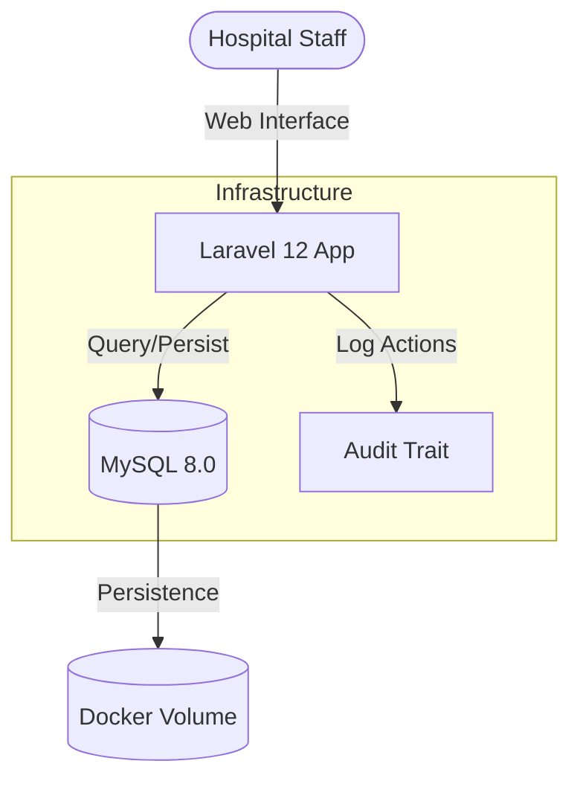

# OrtoTraceability

[](https://laravel.com)
[](https://php.net)
[](https://opensource.org/licenses/MIT)

OrtoTraceability is a management system designed for OPME (Orthotics, Prosthetics, and Special Materials) unit-level traceability. Built on Laravel 12, it provides a functional architecture for tracking medical implants across the surgical workflow.

> [!NOTE]
> **Professional Disclaimer:** This project is a technical and architectural proof-of-concept (PoC) inspired by the author's professional experience in the healthcare sector. It is an original work and DOES NOT replicate, copy, or expose any proprietary code, intellectual property, trade secrets, or sensitive business data from any current or former employer. The system serves solely as a demonstration of technical expertise in medical inventory compliance and secure workflow architecture.

---

## Why This Project Matters

Healthcare systems depend on the traceability of surgical materials (OPME). Poor control often leads to:

*   **Financial Losses:** Denials of insurance claims due to incomplete usage records.
*   **Compliance Risks:** Legal issues arising from an inability to prove material origins.
*   **Patient Safety:** Risks associated with using expired or unvalidated implants.
*   **Audit Gaps:** Challenges in forensic auditing of past surgical procedures.

OrtoTraceability offers an auditable system for tracking materials across the supply chain, ensuring safety and fiscal accountability.

---

## Use Case

1. **Reception:** Distributor deliveries are registered in the hospital inventory.
2. **Allocation:** Materials are linked to specific scheduled surgical procedures.
3. **Usage:** The system records real-time usage (implanted or discarded) during surgery.
4. **Validation:** An automated audit log guarantees traceability (Actor, Timestamp, Action).
5. **Billing:** Data export capabilities support hospital billing and compliance verification.

---

## Core Features

*   **Unit-Level Tracking:** Precise management of batch numbers, serial numbers, and expiration dates.
*   **Surgical Linking:** Dynamic association between surgical schedules and material stock.
*   **Immutable Audit Logs:** Automatic tracking of all CRUD and status-change operations.
*   **Inventory Intelligence:** Real-time dashboards with expiration alerts and automated blocking of expired items.
*   **Secure Authentication:** Integrated access control for authorized personnel.

---

## Tech Stack

*   **Backend:** Laravel 12, MySQL 8.0
*   **Frontend:** Blade Templates, Tailwind CSS, Alpine.js
*   **Infrastructure:** Docker & Docker Compose
*   **Audit Logic:** Custom traits for automated action logging

---

## System Architecture



---

## Installation and Setup

### Prerequisites
*   [Docker](https://www.docker.com/)
*   [Composer](https://getcomposer.org/)

### Setup Steps

1.  **Clone the Repository:**
    ```bash
    git clone https://github.com/Gabrielz11/OrtoTraceability.git
    cd OrtoTraceability
    ```

2.  **Install Dependencies:**
    ```bash
    composer install
    npm install
    ```

3.  **Configure Environment:**
    ```bash
    cp .env.example .env
    php artisan key:generate
    ```

4.  **Initialize Database (via Docker):**
    ```bash
    # Start the containerized services
    docker-compose up -d

    # Run migrations and seed dummy data
    php artisan migrate --seed
    ```

---

## Running the Application

1.  **Start the Server:**
    ```bash
    php artisan serve
    ```
    Access the system at `http://127.0.0.1:8000`.

2.  **Default Credentials:**
    *   **Email:** `admin@hospital.com`
    *   **Password:** `password`

---

## Screenshots

| Dashboard Overview | Material Management | Audit Logs |
| :--- | :--- | :--- |
|  |  |  |

---

## Roadmap

*   [ ] **RFID/Barcode Integration:** Direct hardware scanning support.
*   [ ] **Mobile Client:** Dedicated app for operating room scanning.
*   [ ] **Multi-Hospital Support:** Multi-tenant architecture.
*   [ ] **Advanced Analytics:** AI-driven stock forecasting.

---

## Author and License

**Gabrielz11** - [GitHub](https://github.com/Gabrielz11)

Distributed under the **MIT License**.
