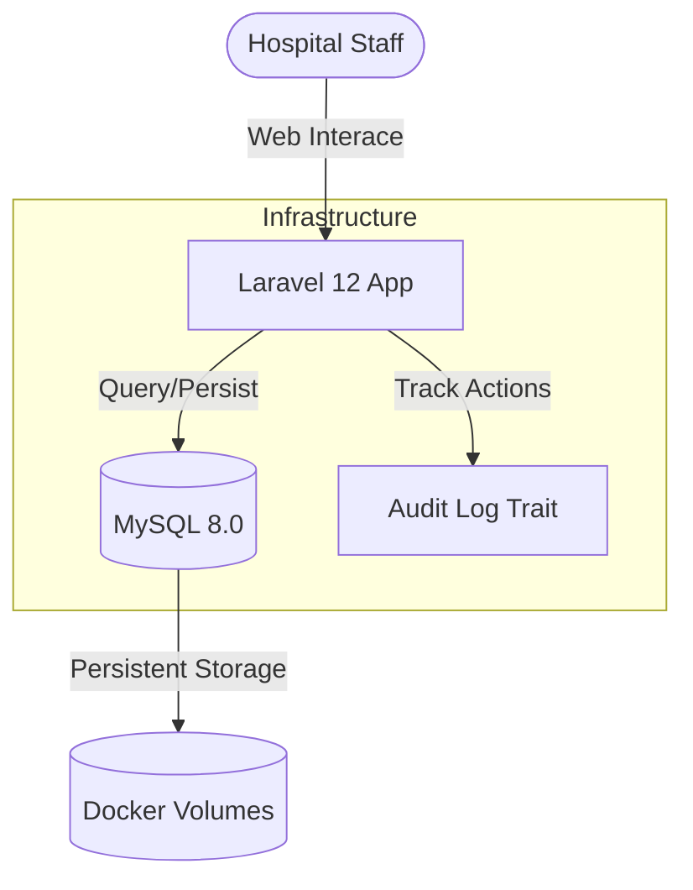
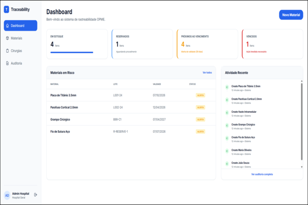
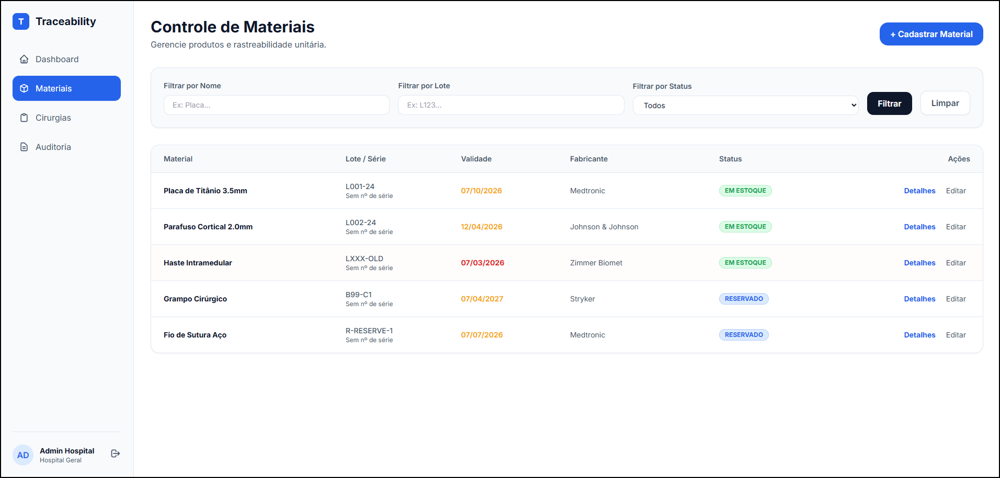
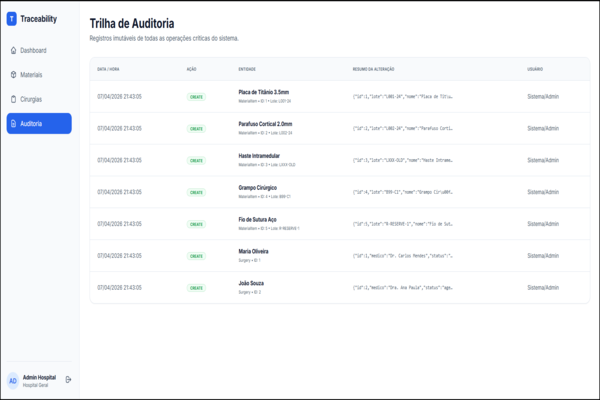

# 🏥 OrtoTraceability

[](https://laravel.com)
[](https://php.net)
[](https://mysql.com)
[](https://docker.com)
[](https://opensource.org/licenses/MIT)

**OrtoTraceability** is a professional management system designed to solve the critical challenges of **OPME** (Orthotics, Prosthetics, and Special Materials) traceability in hospital environments. Built with **Laravel 12**, it ensures that every implant used in surgery is tracked, validated, and audited with absolute precision.

---

## 🌟 Why This Project Matters

Healthcare systems depend heavily on traceability of surgical materials (OPME). The lack of rigorous control can lead to:

- **Financial Losses:** Insurance claim denials due to missing material usage records.
- **Compliance Risks:** Legal and regulatory issues for hospitals failing to prove material origin.
- **Patient Safety Issues:** Risks associated with using expired or unvalidated implants.
- **Audit Deficiencies:** Difficulty in performing forensic audits on past surgical procedures.

**OrtoTraceability** provides a transparent and auditable system for tracking surgical materials across the entire supply chain, ensuring safety and fiscal responsibility.

---

## 🔍 Use Case

1. **Reception:** Distributor sends surgical materials to the hospital.
2. **Allocation:** Materials are registered and linked to a scheduled surgical procedure.
3. **Surgery:** The system records real-time usage (implanted/discarded) during the surgery.
4. **Validation:** An automated audit log guarantees traceability (Who, When, What).
5. **Billing:** Data is exported for seamless hospital billing and compliance verification.

---

## 🚀 Key Features

- **Unit-Level Traceability:** Precise control of batch numbers, unique serial numbers, and expiration dates.
- **Intelligent Surgical Linking:** Smart association between surgical schedules and material batches.
- **Immutable Audit Trail:** Automatic logging of every critical action (Create, Update, Delete, Link, Status Change).
- **Inventory Intelligence:** Dashboard with real-time expiration alerts (30-day window) and automatic blocking of expired items.
- **Secure Access Control:** Integrated authentication for authorized hospital professionals.

---

## 🛠️ Tech Stack

- **Framework:** Laravel 12 (latest)
- **Database:** MySQL 8.0 (Containerized)
- **Frontend:** Blade Templates, Tailwind CSS (Modern UI), and Alpine.js (Lightweight Interactivity).
- **Environment:** Docker & Docker Compose.
- **Security:** CSRF Protection, Password Hashing, and Custom Audit Traits.

---

## 🏗️ System Architecture



---

## 📦 Installation Instructions

### Prerequisites
- [Docker](https://www.docker.com/get-started)
- [PHP 8.2+](https://www.php.net/downloads.php) (optional for local dev)
- [Composer](https://getcomposer.org/)

### Step-by-Step Setup

1. **Clone the Repository:**
   ```bash
   git clone https://github.com/Gabrielz11/OrtoTraceability.git
   cd OrtoTraceability
   ```

2. **Install Dependencies:**
   ```bash
   composer install
   npm install
   ```

3. **Environment Configuration:**
   ```bash
   cp .env.example .env
   php artisan key:generate
   ```

4. **Initialize Database (Docker):**
   ```bash
   # Start the MySQL container
   docker-compose up -d

   # Run migrations and seed demo data
   php artisan migrate --seed
   ```

---

## 🏃 How to Run the Project

1. **Access the Application:**
   Once Docker is running and migrations are finished, start the local server:
   ```bash
   php artisan serve
   ```
   The application will be available at `http://127.0.0.1:8000`.

2. **Demo Access:**
   Login with the pre-configured credentials:
   - **Email:** `admin@hospital.com`
   - **Password:** `password`

---

## 📸 Screenshots

> [!NOTE]
> *Screenshots showcase the Premium Dashboard UI and the Surgical Material Linking interface.*

| Dashboard | Materials | Audit |
| :---: | :---: | :---: |
|  |  |  |

---

## 🗺️ Roadmap & Future Improvements

- [ ] **RFID Integration:** Real-time tracking via hardware scanners.
- [ ] **Mobile App:** Native React Native/Flutter app for barcode scanning in operating rooms.
- [ ] **Multi-Hospital Support:** SaaS architecture for managing multiple healthcare facilities.
- [ ] **Advanced Reports:** AI-driven prediction of stock needs based on surgical volume.

---

## 🤝 Contributing Guidelines

Contributions are what make the open source community such an amazing place to learn, inspire, and create. Any contributions you make are **greatly appreciated**.

1. Fork the Project
2. Create your Feature Branch (`git checkout -b feature/AmazingFeature`)
3. Commit your Changes (`git commit -m 'Add some AmazingFeature'`)
4. Push to the Branch (`git push origin feature/AmazingFeature`)
5. Open a Pull Request

---

## 👨‍💻 Author Information

**Gabrielz11**
- GitHub: [@Gabrielz11](https://github.com/Gabrielz11)
- Project: OrtoTraceability

---

## 📄 License

Distributed under the **MIT License**. See `LICENSE` for more information.

---
*Developed with focus on **Healthcare Quality & Traceability Excellence**.*
